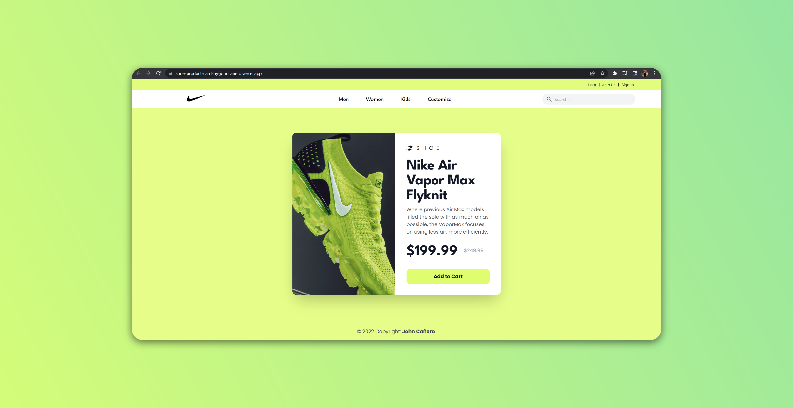
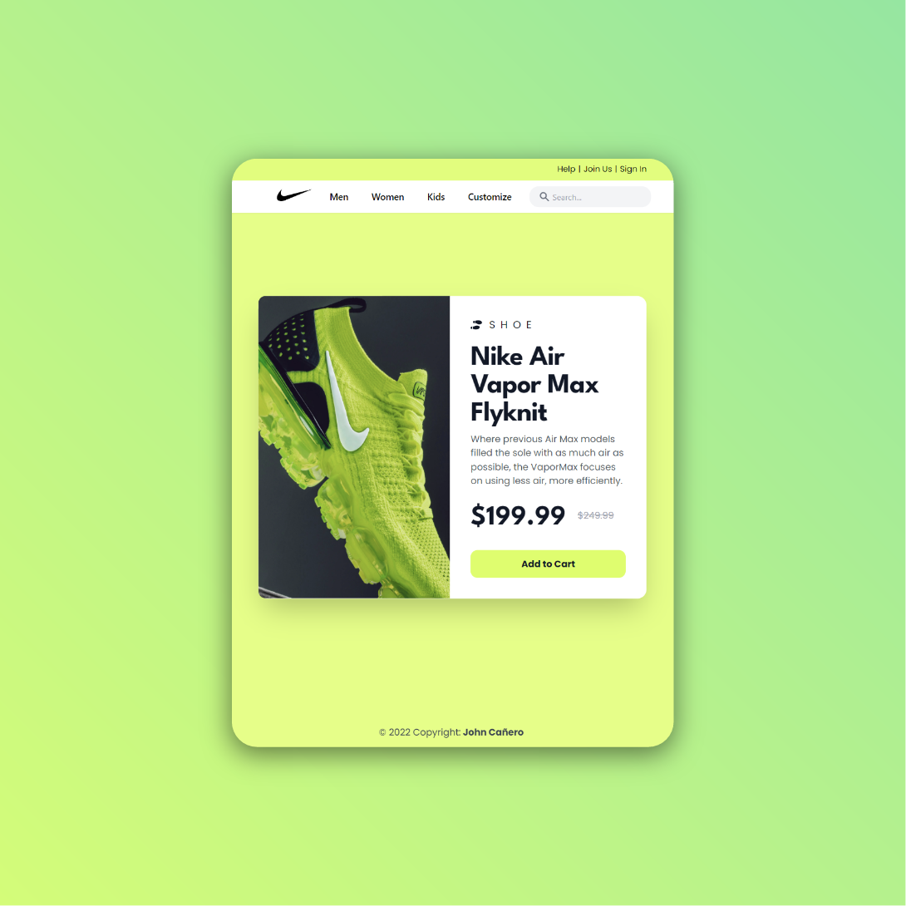
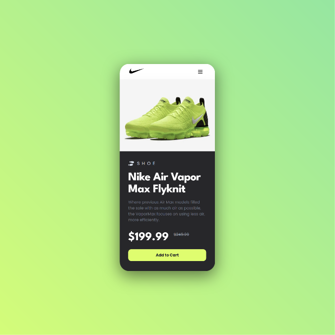
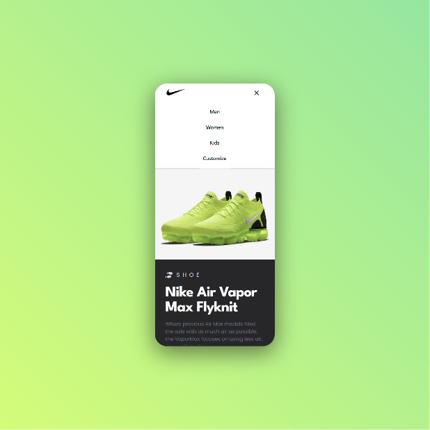
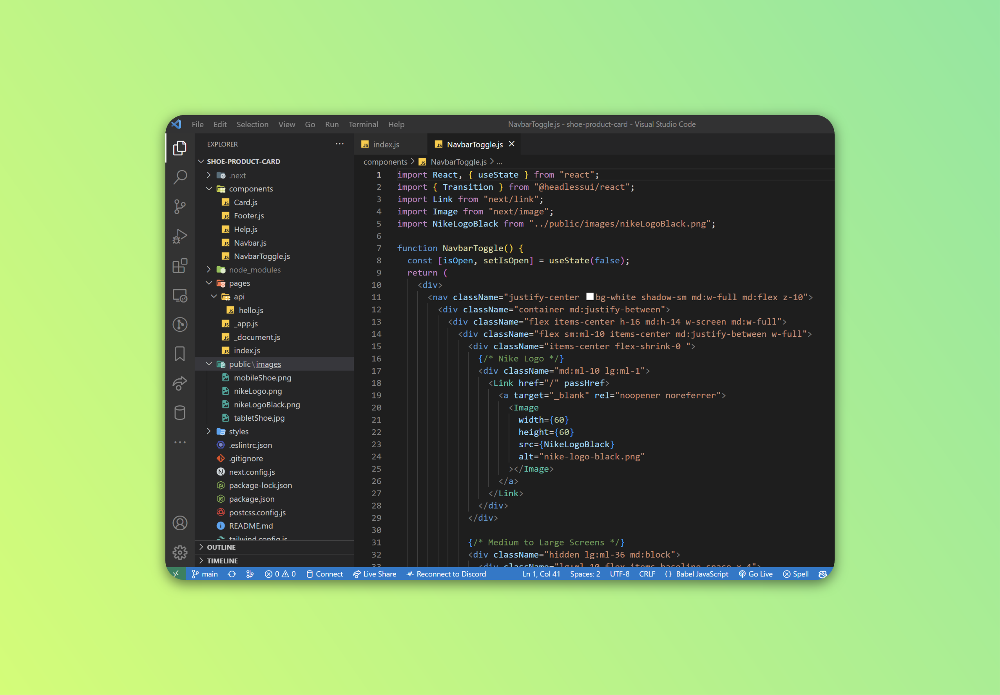

<!-- markdownlint-configure-file {
  "MD013": {
    "code_blocks": false,
    "tables": false
  },
  "MD033": false,
  "MD041": false
} -->

  

# Shoe Product Card

This is the Product Shoe Card: Nike powered by Next Js and Tailwind CSS.

A Toggle Feauture in Mobile and product presentation for Nike.

## Website

🖥️ [https://shoe-product-card-by-johncanero.vercel.app/]

✍️ Project by John Cañero

## Responsive Design

🪟: [Desktop - Tablet - Mobile]

